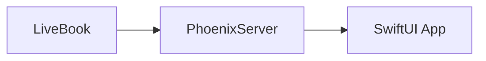

# LiveView Native Guides

**LiveView Native Guides** is an interactive tutorial for LiveView Native using Livebook.

## Usage

For the best experience, we recommend running these guides in Livebook so that you can see how the examples affect a native application. However, you can also read through these guides and try out examples inside of your own Phoenix project.

See our [Getting Started](getting_started.livemd) guide to begin your LiveView Native learning journey!

## How These Guides Work

The LiveBook notebooks in this project run alongside a Phoenix server and native SwiftUI application.

Examples run from the Livebook application update the Phoenix server. The Phoenix server then automatically pushes these changes to the SwiftUI application.

You can change and manipulate examples and complete exercises all within Livebook without modifying the underlying Phoenix App or SwiftUI app.



Below, we'll go over an overview of the implementation of this project and how it all works. However, you do not need to know these details to begin the [Getting Started](getting_started.livemd) guide and start learning LiveView Native. 

### KinoLiveView

Notebooks have examples using a [KinoLiveView](https://github.com/BrooklinJazz/kino_live_view) [SmartCell](https://hexdocs.pm/kino/Kino.SmartCell.html), which dynamically inject LiveViews into a Phoenix application. 

Upon evaluating a smart cell, the Phoenix application's router file automatically updates to include the new LiveView and associated route. Here's the code you'll find in `router.ex` that dynamically includes these LiveViews.

```elixir
# router.ex
scope "/" do
    pipe_through :browser

    KinoLiveView.get_routes()
    |> Enum.map(fn %{path: path, module: module, action: action} ->
        live(path, module, action)
    end)
end
```

Here's an example HelloWorld LiveView in a `KinoNative.SmartCell` you could find in one of our notebooks.


The native and web applications will automatically reload as if you had defined a new LiveView in the Phoenix application.

<!-- tabs-open -->

### IOS

<div height="800" width="100%" style="display: flex; height: 800px; justify-content: center; align-items: center;">
    
</div>
### Web

<div height="800" width="100%" style="display: flex; height: 800px; justify-content: center; align-items: center;">
    
</div>


<!-- tabs-close -->