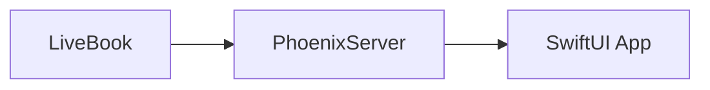
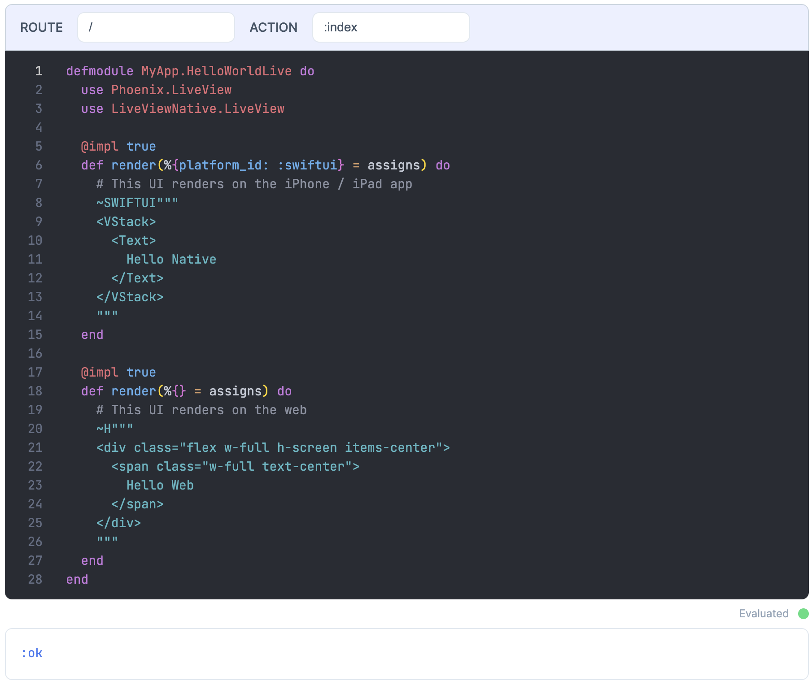
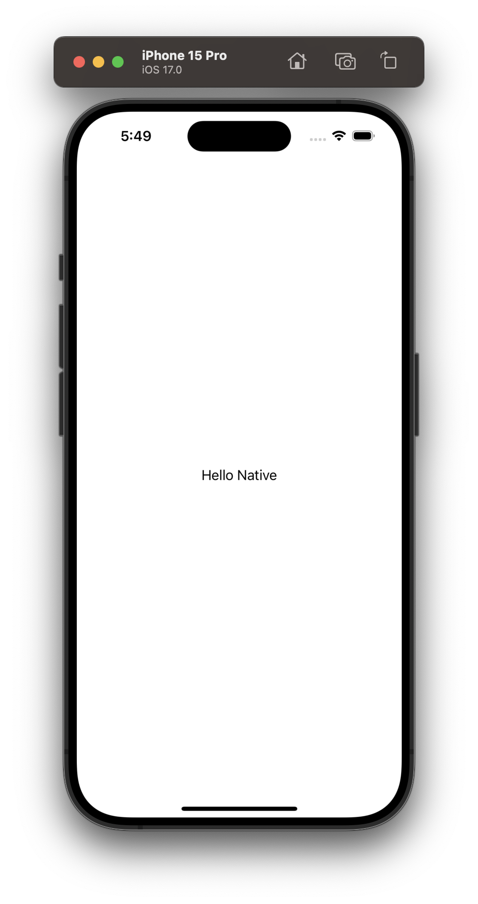
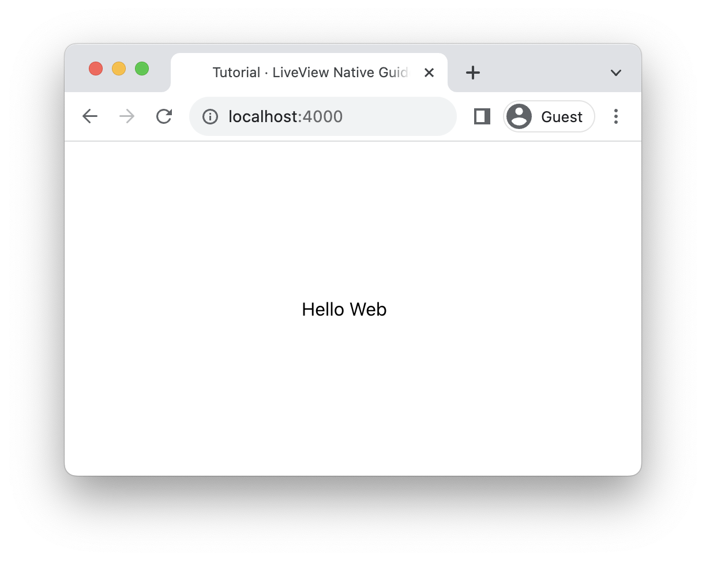

# LiveView Native Guides

**LiveView Native Guides** is an interactive tutorial for LiveView Native using Livebook.

For the best experience, we recommend running these guides in Livebook so that you can see how the examples affect a native application.

See [Getting Started](getting_started.livemd) for steps on how to begin.

## How These Guides Work

The LiveBook notebooks included in this project run alongside a Phoenix server and native SwiftUI application.

Examples run from the Livebook application update the Phoenix server. The Phoenix server then automatically pushes these changes to the SwiftUI application.

You can change and manipulate examples, and even complete exercises all within Livebook without needing to make changes to the underlying Phoenix App or SwiftUI app.



### KinoNative.SmartCell

Notebooks have examples using a `KinoNative.SmartCell` [SmartCell](https://hexdocs.pm/kino/Kino.SmartCell.html) which define LiveViews. Upon evaluating these smart cells, the Phoenix application's router file automatically updates to include the new LiveView and associated route.

```elixir
# router.ex
scope "/" do
    pipe_through :browser

    KinoNative.SmartCell.get_routes()
    |> Enum.map(fn %{path: path, module: module, action: action} ->
        live(path, module, action)
    end)
end
```

Here's an example HelloWorld LiveView in a `KinoNative.SmartCell` you could find in one of our notebooks.



The native application and/or the web application will automatically reload as if you had defined a new LiveView in the Phoenix application.

<!-- tabs-open -->

### IOS

<div height="800" width="100%" style="display: flex; height: 800px; justify-content: center; align-items: center;">
    
</div>
### Web

<div height="800" width="100%" style="display: flex; height: 800px; justify-content: center; align-items: center;">
    
</div>


<!-- tabs-close -->